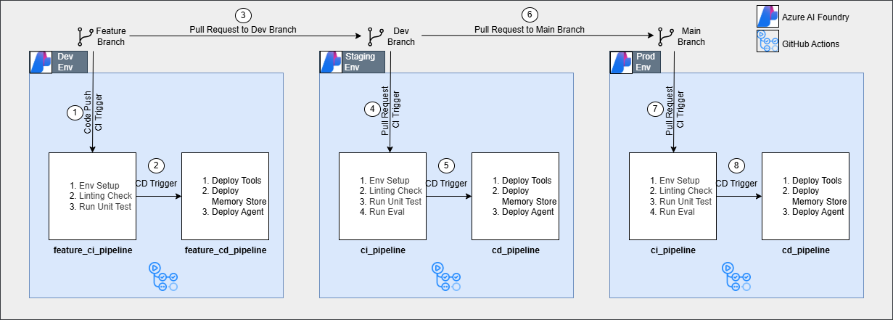

# Azure AI Foundry GenAIOps

## Infrastructure

This architecture uses AI Foundry Agent Service as a runtime to host and serve the agents. The environments (Dev, Staging, Prod) can be seperated in two different ways:

### Seperate Project in Seperate Foundry Resource
In this approach, for each environment a new foundry resource is deployed with foundry project.
[TBC Limitaion]
### Seperate Project within the Same Foundry Resource
In this approach, for each environment is deployed in the same foundry resource in different projects.
[TBC Limitaion]

Agent Service runtime supports multiple artefacts related to agent development with more on the plan to be released. This current design includes the following resources -

- Tools
- Memory Store
- Agents

## Workflow

The workflow is designed to run on GitHub Actions. The following architecture is proposed based on GitFlow type workflow. This can be easily modified to implement GitHub Flow or Trunk-Based Development style workflow.

According to GitFlow convention, we have three branches in this setup - feature branches, dev branch and main branch.

Workflow Components:

1. Continuous Integration: This piepline will build the code and run tests and evals. Eval runs can be reserved for only Dev and Prod environment.

2. Continuous Deployment: This pipeline will deploy the artifacts to Foundry Agent Service.

Workflow steps -

1. Whenever new code is commited to the feature branch, it triggers the feture_ci_pipeline. As expected, the CI pipeline is running lint check and unit tests. But running the agent evaluation may not be useful as  each commit may not have a significant enough change to produce useful eval results. Also running evals may be slow and expensive in certain scenarios.

2. If the CI is successful, the code is deployed to the Dev environment.

3. Once the developer is happy, he can creates a PR to the Dev branch. This will trigger the ci_pipleine.

4. This CI pipeline runs linting, unit tests and evaluations.  If the developer is happy, he creates a PR to the main branch. This creates the CD pipeline.

5. The CD pipeline deploys the agent in the dev environment.

6. If the developer is happy, they create a PR to the main branch. This will trigger the ci_pipleine.

7. This CI pipeline runs linting, unit tests and evaluations.  If the developer is happy, he creates a PR to the main branch. This creates the CD pipeline.

8. The CD pipeline deploys the agent in the dev environment.

